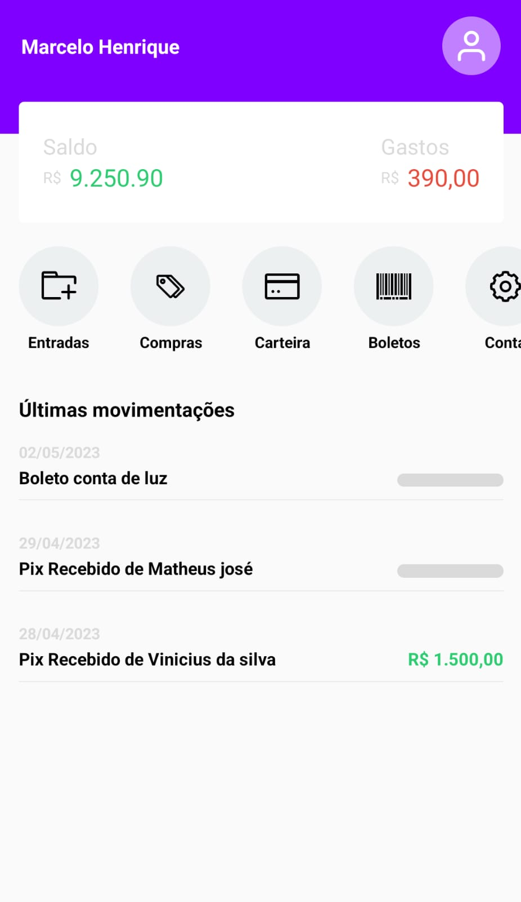

# Clone da Tela Inicial do Nubank em React Native

Este é um projeto desenvolvido em React Native com o objetivo de clonar a tela inicial do Nubank, com o propósito de estudar essa tecnologia
Para posteriormente criar um projeto pessoal de ponta a ponta.

## Pré-requisitos

Para executar este projeto, é necessário ter instalado o seguinte software:

- Node.js
- Yarn
- Expo CLI

## Como executar o projeto

1. Clone este repositório para o seu computador.
2. Abra o terminal na pasta raiz do projeto.
3. Execute o comando `yarn install` para instalar as dependências.
4. Execute o comando `expo start` para iniciar o servidor de desenvolvimento.
5. Abra o aplicativo Expo em seu dispositivo móvel.
6. Escaneie o QR code exibido no terminal com o aplicativo Expo em seu dispositivo móvel.
7. Aguarde a compilação do aplicativo e a sua inicialização.

## Tecnologias utilizadas

- React Native
- Expo
- Styled Components

## Contribuindo

Se você deseja contribuir com este projeto, basta seguir os seguintes passos:

1. Faça um fork deste repositório.
2. Crie uma nova branch com sua contribuição: `git checkout -b minha-contribuicao`
3. Faça as alterações necessárias e commit: `git commit -m "Minha contribuição"`
4. Envie as alterações para o repositório remoto: `git push origin minha-contribuicao`
5. Crie um Pull Request com suas alterações.

## Autor

Este projeto foi desenvolvido por [Marcelo henrique].

## Design

Design do projeto feito por Sujeito Programador no youtube

